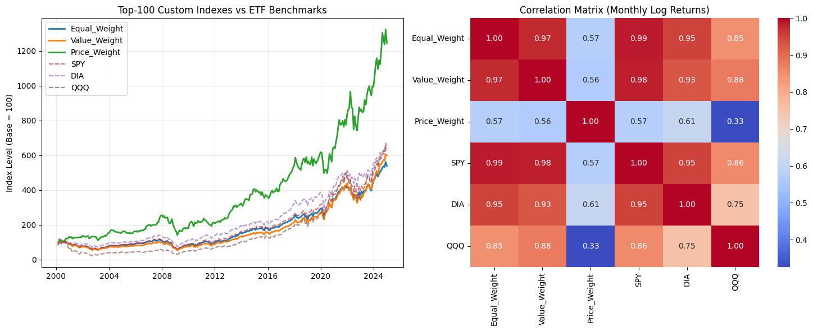

# Creating Custom Equity Indexes

Building and benchmarking three custom U.S. equity indexes (equal-, value-, and price-weighted)
from 25 years of CRSP monthly data, with proper controls for look-ahead and survivorship bias.

> Course project for **FIN 684 - Investment Theory / Advanced Corporate Finance** (Prof. Sury),
> M.S. Business Analytics, McCombs School of Business, UT Austin.
> Team: Nathan Arimilli, Joseph Bailey, Shahmir Javed.

## Problem

Index design is a foundational skill in empirical finance: the *weighting scheme* an index uses
shapes its return, its risk, and how closely it tracks the broad market. This project builds three
custom indexes from the same universe of stocks, differing only in how constituents are weighted,
and asks how much that single choice matters.

## Approach

Using the [`wrds`](https://pypi.org/project/wrds/) Python library, we pull the CRSP Monthly Stock
File and construct a clean monthly panel:

1. **Universe** — U.S. common shares (`shrcd` 10, 11) on NYSE / AMEX / NASDAQ (`exchcd` 1, 2, 3),
   joined to CRSP name history on a time-bounded key so each month gets the correct descriptors.
2. **Cleaning** — absolute-value prices (CRSP's sign convention), shares scaled from thousands,
   market cap = price x shares.
3. **Survivorship bias** — delisting returns merged in via `r_eff = (1 + ret) x (1 + dlret) - 1`.
4. **Index construction** — each month *t*, pick the **Top-100 by market cap as of t-1** and set
   equal / value / price weights from t-1 information, then grow the index by month-*t* returns.
   Using only lagged information avoids look-ahead bias. All indexes start at base 100.
5. **Benchmarking** — compound SPY, DIA, and QQQ into base-100 levels, then compare levels and the
   correlation matrix of monthly log returns.

The example specification (used for the results below) is **Top-100 stocks, 2000-2024**, but the
notebook is parameterized for any window in 2000-2024 and any Top-N from 1 to 2000.

## Results (Top-100, 2000-2024)

| Series | Type | Total return | Annualized |
|--------|------|-------------:|-----------:|
| **Price-Weighted** | custom | **+1,311.9%** | **11.2%** |
| DIA | benchmark | +619.4% | - |
| SPY | benchmark | +569.4% | - |
| Value-Weighted | custom | +504.6% | 7.5% |
| QQQ | benchmark | +462.0% | - |
| Equal-Weighted | custom | +438.3% | 7.0% |

**Correlation of monthly log returns** (full matrix in [`output/correlation_matrix.csv`](output/correlation_matrix.csv)):

- Equal- and value-weighted indexes track SPY almost perfectly (0.99 and 0.98).
- The price-weighted index stands apart (0.33-0.61 vs. the benchmarks); among the ETFs it is closest
  to the (also price-weighted) DIA at 0.61.

**Takeaways**

- Weighting scheme is decisive: the same 100 stocks produced a ~3x spread in total return.
- Price-weighting was the big winner but for a fragile reason: it concentrates in a few very
  high-priced names (the Magnificent 7, Berkshire) that avoided stock splits. High return, low
  diversification, low correlation with the market.
- Value beat equal weighting here, which cuts against a naive small-cap-premium story: within the
  mega-cap top 100, the very largest names led.



## Repo structure

```
.
├── code/      custom_equity_indexes.ipynb  — end-to-end, parameterized pipeline
├── data/      README only (CRSP is licensed and not redistributable; see data/README.md)
├── output/    saved figure + results_summary.csv + correlation_matrix.csv
├── report/    written memo (.pdf), slide deck (.pptx), assignment prompt (.pdf)
└── README.md
```

## How to reproduce

CRSP data is licensed, so you need a **WRDS account with a CRSP subscription**.

```bash
pip install wrds pandas numpy matplotlib seaborn tqdm
```

1. Run `wrds.Connection()` once and follow the prompt to create your `~/.pgpass` (no passwords are
   stored in the code).
2. Open `code/custom_equity_indexes.ipynb`, adjust the **Configuration** cell if desired
   (`START_YEAR`, `END_YEAR`, `TOP_N`), and run all cells. The figure is saved to `output/`.

## Caveats and honest notes

- **Not re-run for this portfolio version.** The headline numbers come from the team's original run.
  They are internally consistent (annualized figures reconcile with totals) and the correlation
  matrix matches the saved exhibit exactly, but reproducing them requires WRDS/CRSP access, which is
  not public.
- **Price-weighting is dominated by a few names.** Its outsized return reflects concentration in
  high-priced stocks rather than broad-based outperformance; treat it as an illustration of how
  weighting can distort an index, not as an investable strategy.
- **DIA substitutes for IWM.** The assignment suggested SPY/IWM/QQQ; IWM and VTI lack full history
  back to 2000, so DIA (full coverage) is used as the third benchmark.
- **Missing delisting returns are set to 0**, a standard conservative assumption.
